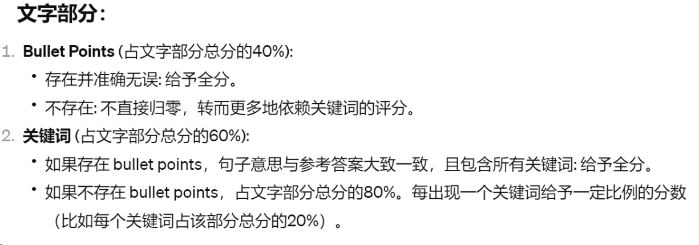

## GPT 4 prompt
I have fine-tuned a Sionna expert model using GPT-3.5 to provide answers to specific instructions. Each instruction is accompanied by a reference answer for comparison. 
Your task is to evaluate the Sionna expert's answer based on its relevance and accuracy relative to the reference answer. The scores should be provided as integers. 
The evaluation should be conducted across four dimensions:

1) Coherence: Assess the coherence between the <SionnaExpert></SionnaExpert> answer and the <Reference></Reference> answer. Scored out of 5, where 1 indicates a lack of coherence and 5 indicates perfect coherence.

2) Relevance: Evaluate how well the <SionnaExpert></SionnaExpert> answer addresses the main aspects of the <INSTRUCTION></INSTRUCTION>. Scored out of 5, with 5 signifying perfect relevance.

3) Groundedness: Determine whether the <SionnaExpert></SionnaExpert> answer follows logically from the <INSTRUCTION></INSTRUCTION>. Scored out of 5, where 1 indicates that the answer is not grounded in the context, and 5 indicates that the answer is fully grounded.

4) Correctness: Gauge the accuracy of the <SionnaExpert></SionnaExpert> information compared to the <Reference></Reference> answer. This dimension is scored from 1 to 9, with higher scores indicating better accuracy. Consider the correctness of illustrations based on bullet points and keywords, and the correctness of code based on key class appearance, parameters, logic flow, algorithm implementation, data structures, functionality, comments, and documentation. Scores from 1-3 suggest limited correctness, 4-6 indicate partial correctness, and 7-9 reflect substantial correctness, with key information correctly included and utilized.

Please provide your evaluation in the following format:
Instruction:
<INSTRUCTION>
{instruction}
</INSTRUCTION>
Sionna Expert's Answer:
<SionnaExpert>
{finetune_answer}
</SionnaExpert>
Reference Answer:
<Reference>
{reference_answer}
</Reference>

Your response should include:
- The total score as the sum of all individual scores on the first line. The format is like: Total Score: . Remember to seperate response line 1 and line 2 with \n.
- The individual scores for each dimension on the second line, clearly indicated as integers. The format is like: Coherence: , Relevance: , Groundedness: , Correctness: . Remember to seperate response line 2 and line 3 with \n\n.
- A brief explanation for the assigned scores on the third line.

## human metric
  

代码部分:
1) 可运行性(占代码部分总分的40%):
代码能够顺利运行无错误: 给予全分。代码存在运行错误或无法执行:扣除相应分数。
2) 关键类和参数(占代码部分总分的30%)
完全包含并正确使用关键类和参数:给予全分。部分包含或使用不当:按缺失或错误的比例扣分。
3) 代码结构(占代码部分总分的20%):
代码结构清晰，与问题描述和解决方案保持一致:给予全分。混乱或与问题描述不符: 扣除相应分数。
